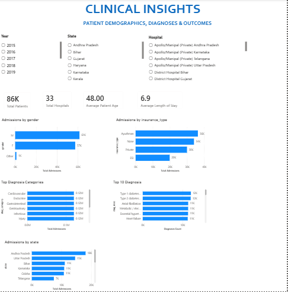
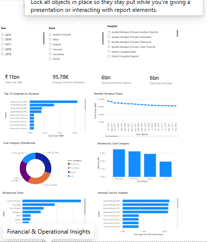

# 🏥 MediFlow Global Healthcare Analytics Dashboard

An interactive **Power BI Healthcare Analytics Dashboard** developed to analyze hospital operations, clinical performance, patient demographics, and financial insights. This project demonstrates data modeling, DAX calculations, KPI development, and dashboard design using real-world healthcare datasets.

---

## 📌 Project Overview

Healthcare organizations generate large volumes of operational and financial data every day. This dashboard transforms raw healthcare data into meaningful business insights, enabling stakeholders to monitor hospital performance, patient trends, clinical outcomes, and financial metrics through interactive visualizations.

---

## 🎯 Business Objectives

- Monitor hospital admissions and patient trends
- Analyze 30-day readmission and mortality rates
- Track patient demographics and diagnosis patterns
- Evaluate hospital financial performance
- Compare hospital and state-wise revenue
- Support data-driven healthcare decision making

---

## 🛠 Tools & Technologies

- **Power BI Desktop**
- **Power Query**
- **DAX (Data Analysis Expressions)**
- **Data Modeling**
- **Microsoft Excel**
- **Git & GitHub**

---

## 📊 Dashboard Pages

### 1️⃣ Executive Overview

Provides a high-level summary of healthcare performance.

**KPIs**
- Total Admissions
- Readmission Rate
- Total Revenue
- Mortality Rate
- Average Length of Stay
- Average Cost per Admission

**Visualizations**
- Monthly Admissions Trend
- Admissions by Ward Type
- Top Diagnosis Categories
- Revenue by Hospital
- Admissions by Age Group
- Readmission Trend

---

### 2️⃣ Clinical Insights

Focuses on patient demographics and clinical analysis.

**KPIs**
- Total Patients
- Total Hospitals
- Average Patient Age
- Average Length of Stay

**Visualizations**
- Admissions by Gender
- Admissions by Insurance Type
- Top Diagnosis Categories
- Top 10 Diagnoses
- Admissions by State

---

### 3️⃣ Financial & Operational Insights

Provides financial analysis of hospitals.

**KPIs**
- Total Revenue
- Average Cost per Admission
- Government Subsidy
- Out-of-Pocket Cost

**Visualizations**
- Top 10 Hospitals by Revenue
- Monthly Revenue Trend
- Cost Category Distribution
- Revenue by Cost Category
- Revenue by State
- Top 10 Hospitals by Average Cost

---

## 📈 Key KPIs

- Total Admissions
- Total Patients
- Total Hospitals
- Readmission Rate
- Mortality Rate
- Average Length of Stay
- Total Revenue
- Government Subsidy
- Out-of-Pocket Cost
- Average Cost per Admission

---

## 🧮 DAX Measures Used

- Total Admissions
- Readmission Rate
- Total Revenue
- Mortality Rate
- Average Length of Stay
- Average Cost per Admission
- Total Government Subsidy
- Total Out-of-Pocket Cost
- Total Patients
- Total Hospitals

---

## 📂 Dataset

The project uses multiple healthcare datasets, including:

- Admissions
- Patients
- Hospitals
- Billing
- Diagnoses
- Date Dimension

---

## 📌 Skills Demonstrated

- Data Cleaning
- Data Transformation
- Data Modeling
- DAX Calculations
- KPI Design
- Interactive Dashboard Development
- Healthcare Analytics
- Business Intelligence
- Data Visualization

---

## 📸 Dashboard Preview

> Dashboard screenshots will be added here.
>
> ## 📸 Dashboard Preview

### Executive Overview

---

### Clinical Insights

---

### Financial & Operational Insights

> ## 📸 Dashboard Preview

### Executive Overview

---

### Clinical Insights

---

### Financial & Operational Insights

- Executive Overview
- Clinical Insights
- Financial & Operational Insights

---

## 🚀 Project Outcomes

This dashboard enables healthcare stakeholders to:

- Monitor hospital performance
- Identify high-performing hospitals
- Analyze patient demographics
- Track financial performance
- Improve operational decision-making
- Monitor healthcare KPIs through interactive dashboards

---

## 👩‍💻 Author

**Aastha Jangra**

GitHub: https://github.com/AasthaJangra6

---

⭐ If you found this project helpful, consider giving it a star!
